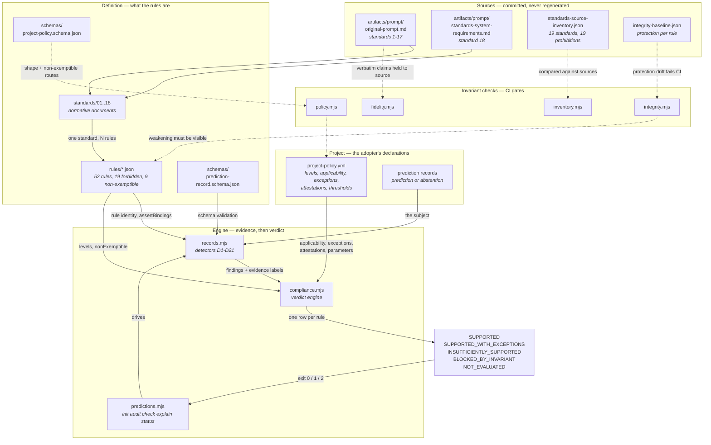

# Architecture

> The canonical source for the diagram below is [`architecture.mmd`](architecture.mmd). The fenced
> block is a copy, and `npm run diagrams` fails if the two drift apart. Edit the `.mmd`, then
> regenerate this document — do not hand-patch the fence.

PredictionStandards evaluates one prediction record at a time. Two committed source specifications
produce eighteen normative documents; the documents produce a rule catalog; the catalog plus a
project policy plus a record produce a verdict. Four invariant checks sit outside that flow and
guard the parts of it that could otherwise be changed without anyone noticing.

## The flow



## The four layers

### Sources

Two specifications, committed verbatim and never edited to fit the implementation. `artifacts/prompt/original-prompt.md`
supplies standards 1-17 and the eighteen must-never rules; `artifacts/prompt/standards-system-requirements.md`
supplies standard 18 and the requirements the system itself must meet.

Two derived-but-hand-reviewed artifacts sit alongside them. `artifacts/standards-source-inventory.json`
is the canonical enumeration of what exists, and `artifacts/integrity-baseline.json` records how
strongly each rule is enforced. **Neither is ever regenerated by a run.** A script that could rewrite
them could redefine the series or weaken a prohibition in silence, and the first response to a red
build would be to run it.

### Definition

`standards/NN-*.md` are the normative documents: what is required, what is prohibited, what the
source said verbatim, what this pack added beyond it, and — in every document's Implementation
section — what is *not* checked and why.

`rules/*.json` is the machine-readable catalog: 52 rules, each with an identity, a level, a severity,
a validation type, an assurance level, and a remediation. Nineteen are `forbidden` and carry a
prohibition; nine of those are `nonExemptible`.

The two schemas define what a valid prediction record and a valid project policy are. They are
executed rather than restated: the hand-written evaluator in `scripts/jsonschema.mjs` throws on any
keyword it does not implement, so a constraint can never be silently skipped.

### Project

What an adopter writes. `project-policy.yml` declares levels, applicability, exceptions,
attestations, and the numeric thresholds — none of which come from the source specifications, all of
which are domain judgements. Prediction records are the artifacts being judged.

### Engine

`records.mjs` holds the detectors and produces findings, each labelled `OBSERVED` (resting on a
defined structure) or `INFERRED` (resting on a heuristic). `compliance.mjs` turns findings, policy,
and catalog into one row per rule and a single verdict. `predictions.mjs` is the command line.

`assertBindings` connects the catalog to the detectors and throws if a finding names a rule the
catalog does not define — the mechanical guard on the three-way separation.

## The three-way separation

The load-bearing architectural rule:

```text
The catalog defines rule identity and metadata.
project-policy.yml defines project applicability.
The evaluator produces evidence.
None of the three may redefine the others.
```

Without it the evaluator grows a private copy of rule metadata within a week, and the policy starts
inventing rules the catalog does not carry.

## Why the invariant checks sit outside the flow

Everything in the main flow can be satisfied by changing the thing being checked. The four guards
exist because the cheapest way to pass a rule is to edit the rule:

| Guard | What it makes impossible to do quietly |
|---|---|
| `inventory.mjs` | dropping a standard or reweighting a prohibition list |
| `fidelity.mjs` | rewording a quoted prohibition so it no longer covers the case |
| `integrity.mjs` | lowering a rule's level, severity, or non-exemptible flag |
| `policy.mjs` | waiving a non-exemptible rule through a policy declaration |

None of them prevents the change. Each makes it visible — a second edit, in a file whose only purpose
is to record what the first edit altered. That is the achievable goal, and it is
[Standard 18](../standards/18-standards-integrity.md).

## Verdict precedence

```text
NOT_EVALUATED           no policy, or the record could not be read  -> exit 2
BLOCKED_BY_INVARIANT    a non-exemptible rule failed, or one was    -> exit 1
                        waived, downgraded, or reclassified
INSUFFICIENTLY_SUPPORTED  an ordinary applicable rule failed        -> exit 1
SUPPORTED_WITH_EXCEPTIONS passed via an approved exception          -> exit 0
SUPPORTED               every evaluated applicable rule passed      -> exit 0
```

Checked in that order, so blocking always wins over ordinary failure. A well-formed abstention
reaches `SUPPORTED`.

## What is deliberately absent

- **No model evaluation.** Every rule's subject is a prediction record. See
  [ml-vs-prediction-boundary.md](ml-vs-prediction-boundary.md).
- **No outcome field.** Records describe what was known when the prediction was made. Recording what
  happened would make the outcome-bias errors easier to commit, not harder.
- **No third-party dependencies.** CI has no install step, so adding one breaks the build.
- **No wall-clock reads in evaluation.** `--as-of` makes every run reproducible.
